# EVRP遗传算法执行流程图

## 📋 算法整体架构

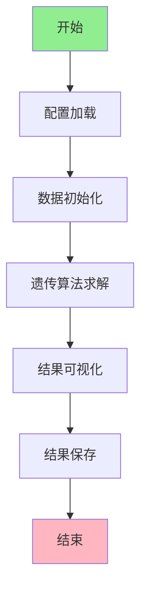

## 🔧 详细执行流程

### 1. 配置加载阶段
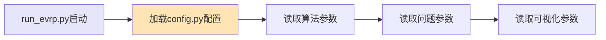

**配置内容包括：**
- **遗传算法参数**: 种群大小、迭代次数、交叉率、变异率
- **问题参数**: 客户数量、充电站数量、车辆容量、电池容量
- **可视化参数**: 是否保存图片、实时绘图开关

### 2. 数据初始化阶段
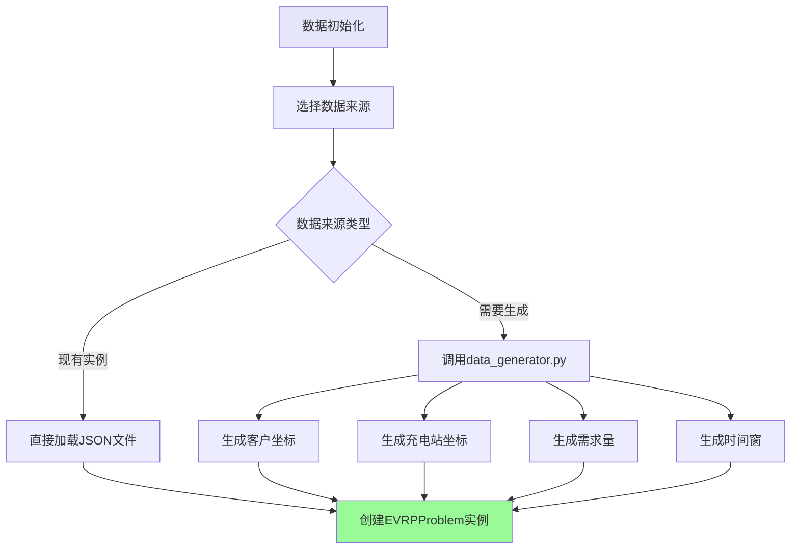

### 3. 遗传算法核心流程
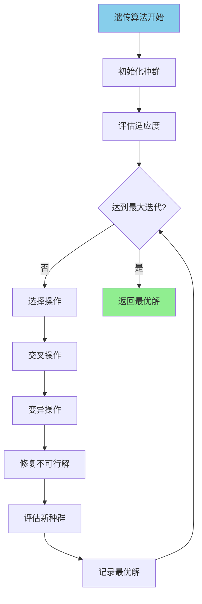

### 4. 染色体编码与解码
```mermaid
graph TD
    A[染色体表示] --> B[路径编码方式]
    B --> C[客户序列编码]
    B --> D[充电站插入策略]
    
    C --> E[示例: [1,2,3,4,5]]
    D --> F[动态插入充电站]
    F --> G[考虑电量约束]
    F --> H[考虑载重约束]
    
    style A fill:#F0E68C
    style E fill:#FFB6C1
```

**编码示例：**
```
原始客户序列: [1, 2, 3, 4, 5, 6, 7, 8, 9, 10]
考虑充电站后: [1, 2, C1, 3, 4, 5, C2, 6, 7, 8, C1, 9, 10]
其中C1, C2表示充电站
```

### 5. 适应度计算流程
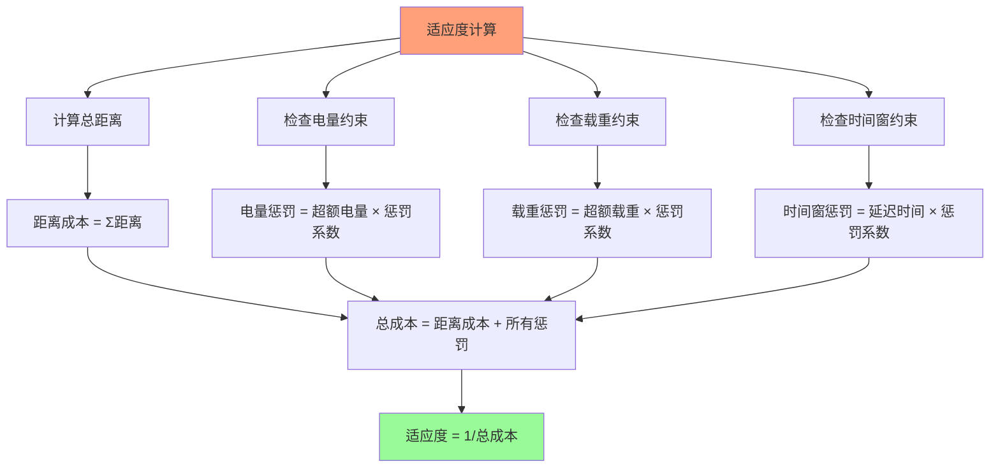

### 6. 遗传操作详解

#### 6.1 选择操作


#### 6.2 交叉操作
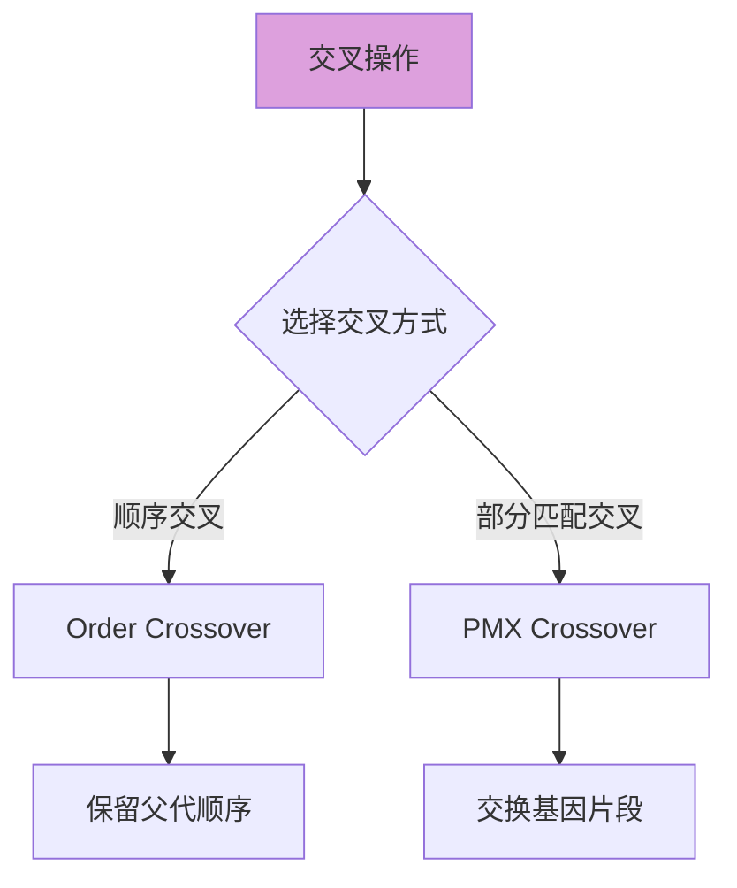

#### 6.3 变异操作
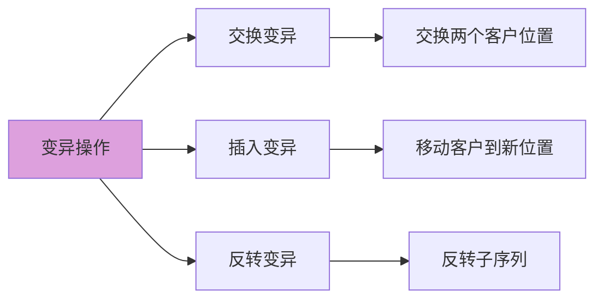

### 7. 约束处理机制
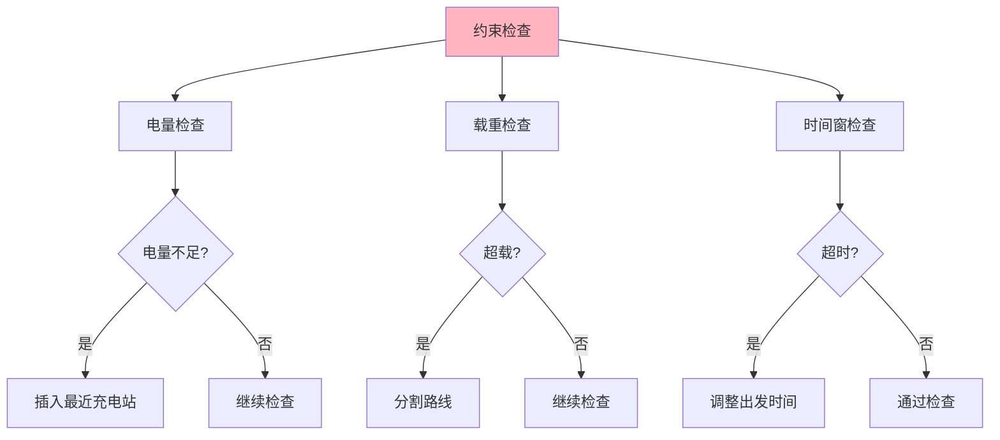

### 8. 可视化输出流程
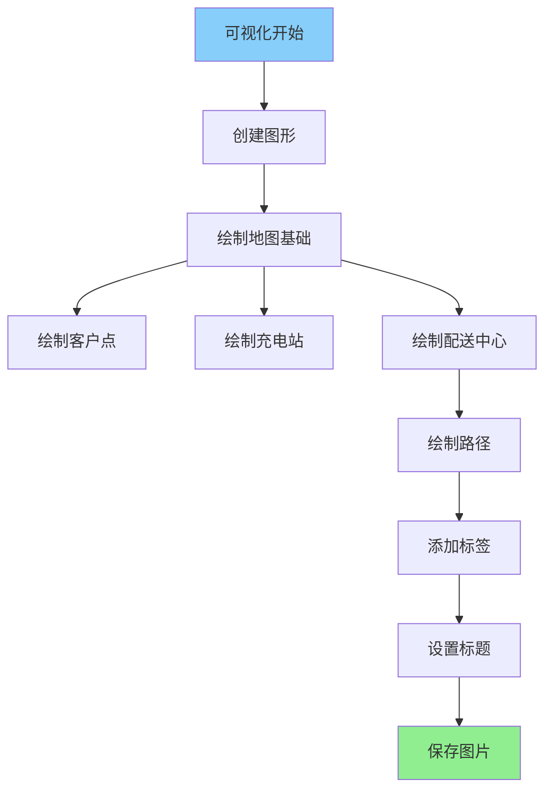

## 📊 数据流动图

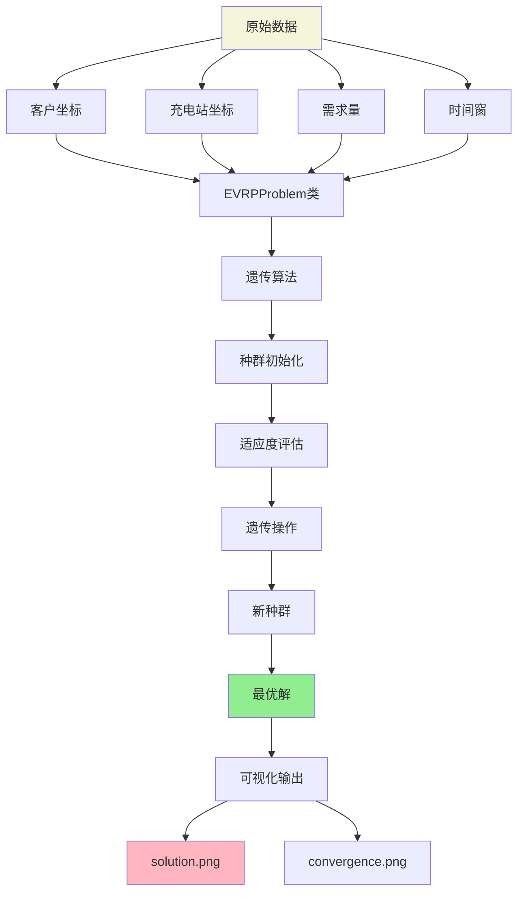

## 🎯 关键类关系图

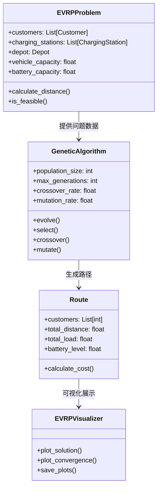

## 🚀 快速开始指南

### 步骤1: 运行测试
```bash
# 生成测试实例
python run_evrp.py --generate --customers 10 --stations 3

# 运行算法
python run_evrp.py --problem results/evrp_10c_3s_uniform.json
```

### 步骤2: 查看结果
- 查看 `results/` 目录下的图片文件
- 检查 `solution.png` 查看路径规划
- 检查 `convergence.png` 查看算法收敛

### 步骤3: 理解输出
- **配送中心**: 红色星号标记
- **客户点**: 蓝色圆点标记
- **充电站**: 绿色三角形标记
- **路径**: 彩色线条表示不同车辆的路径

## 📈 算法性能指标

### 评估标准
1. **总行驶距离**: 所有车辆路径长度之和
2. **车辆利用率**: 实际载重/最大载重
3. **电池利用率**: 实际用电量/电池容量
4. **客户满意度**: 按时送达率

### 收敛指标
1. **最优成本**: 每代的最优解成本
2. **平均成本**: 种群的平均成本
3. **收敛速度**: 达到稳定解的迭代次数