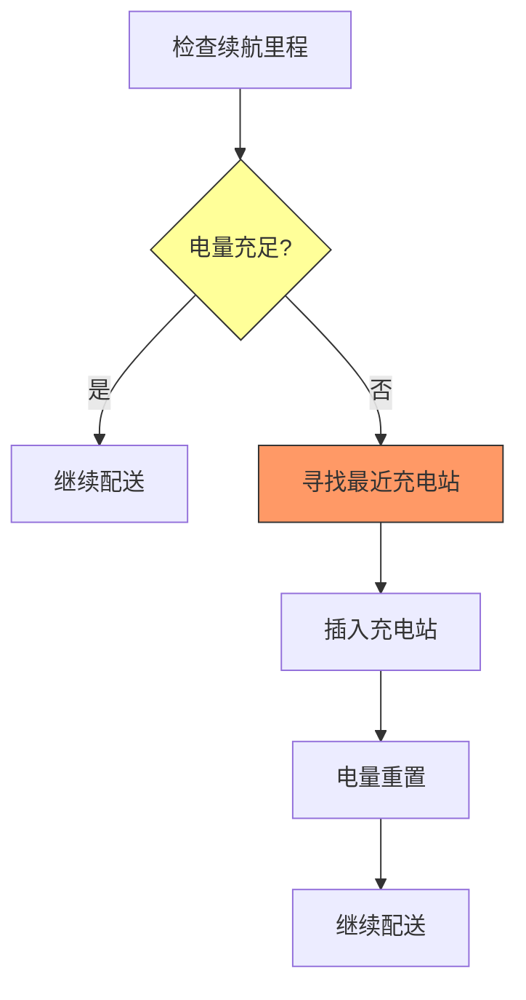
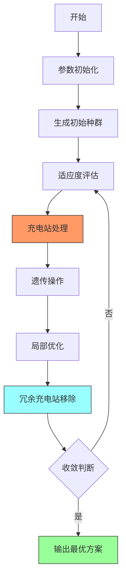

# GA_SDEVRP - 电动车辆需求可拆分路径问题遗传算法求解器

## 问题描述

电动车辆需求可拆分路径问题（Split Delivery Electric Vehicle Routing Problem, SDEVRP）是在SDVRP基础上增加了电动车辆的特殊约束。该问题不仅考虑了需求拆分的特性，还引入了电动车辆的续航里程限制和充电站访问需求。

### 数学模型

#### 符号定义
- **集合**
  - $V = \{0, 1, 2, ..., n\}$：所有节点集合，0表示配送中心
  - $C = \{1, 2, ..., n_c\}$：客户点集合
  - $F = \{n_c+1, ..., n\}$：充电站集合
  - $K$：电动车辆集合

- **参数**
  - $d_i$：客户点$i$的需求量
  - $Q$：电动车辆的最大载重容量
  - $c_{ij}$：从节点$i$到节点$j$的运输成本
  - $L$：电动车辆的最大续航里程
  - $B$：电动车辆的电池容量（kWh）
  - $\rho$：单位距离能耗（kWh/km）
  - $\tau$：充电速率（kWh/h）

- **决策变量**
  - $x_{ijk} \in \{0,1\}$：车辆$k$是否从节点$i$直接前往节点$j$
  - $y_{ik} \geq 0$：车辆$k$在客户点$i$的配送量
  - $u_{ik}$：车辆$k$到达节点$i$时的电池电量
  - $z_{ik} \in \{0,1\}$：车辆$k$是否在充电站$i$充电

#### 目标函数
最小化总运输成本：
$$\min \sum_{k \in K} \sum_{i \in V} \sum_{j \in V} c_{ij} x_{ijk}$$

#### 约束条件

1. **需求满足约束**（与SDVRP相同）
   $$\sum_{k \in K} y_{ik} = d_i, \quad \forall i \in C$$

2. **车辆容量约束**（与SDVRP相同）
   $$\sum_{i \in C} y_{ik} \leq Q, \quad \forall k \in K$$

3. **续航里程约束**
   - 电量更新方程：
   $$u_{jk} = u_{ik} - \rho \cdot c_{ij} + \tau \cdot z_{jk}, \quad \forall (i,j), \forall k$$
   - 电量限制：
   $$0 \leq u_{ik} \leq B, \quad \forall i \in V, \forall k$$

4. **充电逻辑约束**
   - 只有在访问充电站时才能充电：
   $$z_{ik} \leq \sum_{j \in V} x_{jik}, \quad \forall i \in F, \forall k$$

5. **路径连续性约束**（与SDVRP相同）

6. **充电站访问策略**
   - 当剩余电量不足以到达下一个客户点时，必须访问充电站
   - 充电后电量重置为满电状态（简化模型）

## 算法框架

### 改进的遗传算法

#### 编码方案
在SDVRP编码基础上增加充电站信息：
- 主染色体：客户点访问顺序（TSP编码）
- 辅助信息：充电站插入位置和充电策略

#### 特殊处理机制

##### 充电站处理


##### 充电策略
1. **预防性充电**：在电量降至阈值前主动寻找充电站
2. **应急性充电**：当电量不足时强制插入充电站
3. **机会性充电**：在路径优化中考虑充电站位置优势

#### 算法流程


### 关键改进

#### 适应度函数增强
$$fitness = \frac{1}{TotalCost + \alpha \cdot VehicleCost + \beta \cdot ChargePenalty}$$
其中：
- $ChargePenalty$：充电站访问的惩罚成本
- $\beta$：充电成本权重系数

#### 特殊遗传算子
1. **充电感知交叉**：保持充电站位置的相对稳定性
2. **电量约束变异**：确保变异操作不违反电量约束
3. **充电策略优化**：动态调整充电站访问策略

### 局部优化策略

#### 充电站优化
- **冗余充电站移除**：识别并移除不必要的充电站访问
- **充电站重定位**：优化充电站在路径中的位置
- **充电时机优化**：调整充电时机以最小化总成本

#### 路径优化
- **电量感知2-opt**：考虑电量约束的路径优化
- **充电站间重排序**：优化充电站间的访问顺序
- **客户点重分配**：在考虑充电约束的前提下重新分配客户点

## 实验数据

### 测试算例扩展
在Solomon算例基础上增加：
- **充电站位置**：基于实际城市充电网络分布
- **充电站容量**：考虑充电站服务能力限制
- **充电成本**：不同充电站的服务费用差异

### 电动车辆参数
| 参数 | 取值范围 | 说明 |
|------|----------|------|
| 电池容量 | 50-100 kWh | 根据车型不同 |
| 续航里程 | 200-500 km | 取决于电池容量和能耗 |
| 充电速率 | 10-50 kW | 快充/慢充差异 |
| 单位能耗 | 0.15-0.25 kWh/km | 受载重和路况影响 |

### 充电站配置
| 类型 | 充电功率 | 服务时间 | 分布特征 |
|------|----------|----------|----------|
| 快充站 | 50 kW | 30-60分钟 | 城市主干道 |
| 慢充站 | 10 kW | 2-4小时 | 停车场/小区 |
| 换电站 | 全自动 | 5-10分钟 | 高速公路服务区 |

### 实验结果对比

#### 算法性能指标
- **解的质量**：与精确算法相比的gap
- **计算效率**：算法运行时间
- **收敛速度**：达到最优解的代数
- **鲁棒性**：不同算例下的稳定性

#### 关键发现
1. **充电站密度影响**：充电站密度越高，路径优化空间越大
2. **续航里程敏感性**：续航里程对解的质量有显著影响
3. **充电策略重要性**：智能充电策略可显著降低总成本

### 可视化结果
- **路径图**：显示车辆路径和充电站位置
- **电量曲线**：展示每辆车的电量变化
- **充电站利用率**：分析充电站使用频率
- **收敛曲线**：算法优化过程展示

## 文件结构

```
GA_SDEVRP/
├── Main.m                    # 主程序入口
├── GA_SDVRP.m               # 遗传算法框架
├── Fitness.m                # 适应度计算（含电量约束）
├── InitPop.m                # 初始化种群（含充电站）
├── Select.m                 # 选择算子
├── Crossover.m              # 交叉算子（充电感知）
├── Mutate.m                 # 变异算子（电量约束）
├── Reverse.m                # 逆转算子
├── Reins.m                  # 重插入操作
├── TSPtoChrom.m             # TSP到SDEVRP转换
├── RemoveRedundantChargers.m # 移除冗余充电站
├── localsearch.m            # 局部优化（含充电优化）
├── TextOutput.m             # 结果输出（含充电信息）
├── DrawPath.m               # 可视化（显示充电站）
├── sdvrp_instance.m         # 算例生成（含充电站）
├── instance/                # 测试算例（含充电站数据）
│   ├── C/                   # 聚类分布算例
│   ├── R/                   # 随机分布算例
│   └── RC/                  # 混合分布算例
└── resources/               # 项目资源
```

## 使用说明

### 环境要求
- MATLAB R2018b或更高版本
- 建议内存：8GB以上（处理大规模算例）

### 运行步骤
1. 设置工作目录到GA_SDEVRP文件夹
2. 在Main.m中配置参数：
   ```matlab
   % 电动车辆参数
   BatteryCap = 50;      % 电池容量(kWh)
   EnergyConsump = 0.2;   % 单位能耗(kWh/km)
   ChargeRate = 10;       % 充电速率(kWh/h)
   
   % 充电站设置
   ChargeStationNum = 10; % 充电站数量
   ```
3. 运行Main.m开始优化

### 高级配置
- **充电策略调整**：修改充电站插入逻辑
- **电量阈值设置**：调整触发充电的剩余电量阈值
- **充电成本权重**：调整充电成本在目标函数中的权重

### 结果解读
算法输出包含：
- 最优路径方案
- 每辆车的电量变化曲线
- 充电站访问序列
- 总运输成本（含充电成本）
- 充电站利用率分析
- 路径可视化图（显示充电站位置）

## 扩展应用

### 实际场景适配
- **城市配送**：考虑交通拥堵和充电站排队
- **冷链物流**：考虑制冷设备对电量的额外消耗
- **多车型混合**：不同续航里程车辆的协同配送
- **动态充电定价**：根据时段调整充电成本

### 算法改进方向
- **多目标优化**：同时考虑成本、时间、环境影响
- **鲁棒优化**：处理充电站故障和电量不确定性
- **实时调度**：结合实时交通和充电站状态
- **机器学习**：预测充电需求和优化充电策略