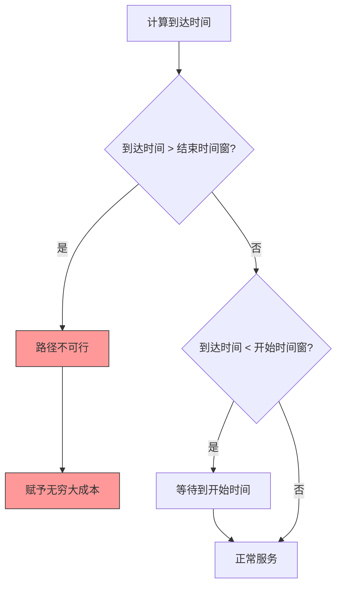
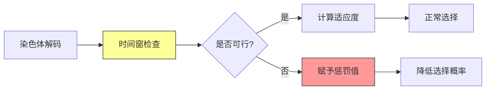

# GA_SDEVRPTW (硬时间窗) - 带硬时间窗的电动车辆需求可拆分路径问题

## 问题描述

带硬时间窗的电动车辆需求可拆分路径问题（Split Delivery Electric Vehicle Routing Problem with Hard Time Windows, SDEVRPTW-Hard）是SDEVRP的重要扩展。该问题的关键特征是：每个客户点都有严格的时间窗约束，如果车辆不能在指定的时间窗内到达并完成服务，则该路径被视为不可行。

### 数学模型

#### 符号定义
- **集合**
  - $V = \{0, 1, 2, ..., n\}$：所有节点集合
  - $C = \{1, 2, ..., n_c\}$：客户点集合
  - $F = \{n_c+1, ..., n\}$：充电站集合
  - $K$：电动车辆集合

- **参数**
  - $d_i$：客户点$i$的需求量
  - $Q$：车辆载重容量
  - $c_{ij}$：从节点$i$到节点$j$的运输成本
  - $t_{ij}$：从节点$i$到节点$j$的行驶时间
  - $[e_i, l_i]$：客户点$i$的时间窗（硬约束）
  - $s_i$：客户点$i$的服务时间
  - $L$：车辆最大续航里程
  - $B$：电池容量

- **决策变量**
  - $x_{ijk} \in \{0,1\}$：路径决策变量
  - $y_{ik} \geq 0$：配送量变量
  - $a_{ik}$：车辆$k$到达客户点$i$的时间
  - $u_{ik}$：电池电量变量

#### 目标函数
最小化总运输成本：
$$\min \sum_{k \in K} \sum_{i \in V} \sum_{j \in V} c_{ij} x_{ijk}$$

#### 硬时间窗约束

1. **严格时间窗约束**
   $$e_i \leq a_{ik} \leq l_i, \quad \forall i \in C, \forall k$$
   **关键特征**：任何违反此约束的路径都将被视为不可行（赋予无穷大成本）。

2. **时间连续性约束**
   $$a_{jk} \geq a_{ik} + s_i + t_{ij} - M(1 - x_{ijk}), \quad \forall i,j \in V, \forall k$$
   其中$M$是足够大的常数。

3. **等待时间处理**
   如果车辆提前到达客户点，必须等待到时间窗开始：
   $$a_{ik} = \max(a_{prev(i),k} + s_{prev(i)} + t_{prev(i),i}, e_i)$$

#### 其他约束条件

4. **需求满足约束**（与SDEVRP相同）
5. **车辆容量约束**（与SDEVRP相同）
6. **续航里程约束**（与SDEVRP相同）
7. **充电站逻辑约束**（与SDEVRP相同）

### 硬时间窗的处理策略

#### 不可行路径判定


#### 时间窗冲突检测算法
1. **前向时间推进**：从配送中心开始，逐步计算每个节点的到达时间
2. **等待时间计算**：提前到达时的等待时间
3. **冲突识别**：识别任何超过时间窗的路径
4. **不可行标记**：对违反时间窗的路径赋予无穷大成本

## 算法框架

### 时间窗感知的遗传算法

#### 特殊编码方案
在传统编码基础上增加时间窗可行性检查：
- **时间窗预处理**：计算每个客户点的最早和最晚服务时间
- **可行性标签**：为每个染色体添加时间窗可行性标记
- **时间窗距离**：定义考虑时间窗的路径距离度量

#### 时间窗约束处理流程


### 关键算法改进

#### 时间窗适应度函数
$$fitness = \begin{cases}
\frac{1}{TotalCost + \alpha \cdot VehicleCost}, & \text{如果满足所有时间窗} \\
\frac{1}{M}, & \text{如果违反任何时间窗}
\end{cases}$$
其中$M$是足够大的惩罚值。

#### 时间窗感知遗传算子
1. **时间窗优先选择**：优先选择满足时间窗的染色体
2. **时间窗保护交叉**：在交叉操作中保持时间窗可行性
3. **时间窗修复变异**：对违反时间窗的染色体进行修复

### 局部优化策略

#### 时间窗优化
- **时间窗调整**：在满足约束的前提下调整服务时间
- **路径重排序**：优化客户点访问顺序以减少等待时间
- **充电时机优化**：平衡充电时间和时间窗约束

#### 充电站-时间窗协同优化
- **充电站选择**：选择既能满足电量需求又不违反时间窗的充电站
- **充电时间计算**：精确计算充电所需时间对时间窗的影响
- **等待策略优化**：最小化因充电或时间窗导致的等待时间

## 实验数据

### 扩展的测试算例

#### 时间窗特征分析
| 算例类型 | 时间窗宽度 | 时间窗分布 | 服务时间 | 典型场景 |
|----------|------------|------------|----------|----------|
| C类 | 窄-中等 | 聚类分布 | 90分钟 | 城市商业区 |
| R类 | 宽 | 随机分布 | 90分钟 | 郊区配送 |
| RC类 | 中等 | 混合分布 | 90分钟 | 混合区域 |

#### 时间窗参数设置
- **C类算例**：时间窗相对集中，服务时间要求严格
- **R类算例**：时间窗较宽，提供更大的调度灵活性
- **RC类算例**：时间窗适中，平衡了效率和约束

### 算法性能评估

#### 时间窗可行性指标
- **可行率**：生成的解中满足所有时间窗的比例
- **平均等待时间**：因时间窗导致的平均等待时间
- **时间窗利用率**：实际服务时间在时间窗内的比例

#### 关键实验结果
1. **时间窗严格性影响**：时间窗越严格，可行解空间越小
2. **充电站密度与时间窗**：充电站位置对时间窗可行性有重要影响
3. **算法收敛性**：硬约束导致收敛速度相对较慢

### 可视化分析

#### 时间窗甘特图
```
客户点    时间窗          实际服务时间
C1    [9:00-10:00]     9:15-9:45
C2    [10:30-11:30]   10:45-11:15
C3    [14:00-15:00]   14:20-14:50
```

#### 时间窗冲突分析
- **冲突类型**：到达过晚、等待时间过长
- **冲突频率**：不同算例下的冲突发生概率
- **冲突解决**：通过充电站调整或路径重规划解决

## 文件结构

```
GA_SDEVRPTW(硬时间窗)/
├── GA_SDEVRPTW_Main.m         # 主程序入口（硬时间窗版本）
├── GA_SDVRP.m                # 遗传算法框架（时间窗增强）
├── Fitness.m                 # 适应度计算（硬时间窗检查）
├── InitPop.m                 # 种群初始化（时间窗感知）
├── Select.m                  # 选择算子（时间窗优先）
├── Crossover.m               # 交叉算子（时间窗保护）
├── Mutate.m                  # 变异算子（时间窗修复）
├── Reverse.m                 # 逆转算子（时间窗检查）
├── Reins.m                   # 重插入操作
├── TSPtoChrom.m              # TSP到SDEVRPTW转换
├── RemoveRedundantChargers.m # 冗余充电站移除（时间窗考虑）
├── localsearch.m             # 局部优化（时间窗优化）
├── TextOutput.m              # 结果输出（含时间窗信息）
├── DrawPath.m                # 可视化（显示时间窗）
├── sdvrp_instance.m          # 算例生成（含时间窗数据）
├── instance/                 # 测试算例（含时间窗数据）
│   ├── C/                    # 聚类分布算例
│   ├── R/                    # 随机分布算例
│   └── RC/                   # 混合分布算例
└── resources/                # 项目资源
```

## 使用说明

### 关键参数配置
在GA_SDEVRPTW_Main.m中设置：

```matlab
% 时间窗相关参数
TravelTime    % 节点间行驶时间矩阵
TimeWindow    % 客户点时间窗[e_i, l_i]
ServiceTime   % 客户点服务时间s_i

% 电动车辆参数
BatteryCap = 50;      % 电池容量(kWh)
EnergyConsump = 0.2;   % 单位能耗(kWh/km)
ChargeRate = 10;       % 充电速率(kWh/h)

% 算法参数（针对硬约束优化）
NIND = 80;            % 较大种群以应对约束
MAXGEN = 500;         % 增加代数确保收敛
Pm = 0.5;             % 较高变异率以探索可行解
```

### 时间窗数据格式
```
节点    X坐标   Y坐标   需求量   开始时间窗   结束时间窗   服务时间
0      40      50      0        0          1236        0
1      45      68      10       912        967         90
2      45      70      30       825        870         90
...
```

### 结果解读
算法输出包含：
- **时间窗满足率**：100%（硬约束保证）
- **实际到达时间**：每个客户点的实际服务时间
- **等待时间**：因时间窗导致的等待时间
- **充电时间**：在各充电站的充电时长
- **路径甘特图**：显示时间窗和服务时间的可视化

### 调试建议
1. **时间窗冲突检查**：验证时间窗约束的正确性
2. **充电时间计算**：确保充电时间不影响时间窗
3. **路径可行性**：检查所有路径是否满足硬约束
4. **算法收敛**：监控可行解的收敛过程

## 实际应用场景

### 典型应用领域
1. **生鲜配送**：严格的配送时间要求
2. **医药物流**：药品配送的时间敏感性
3. **电商配送**：预约配送时间窗口
4. **冷链运输**：易腐商品的时间约束

### 业务约束建模
- **客户预约时间**：客户指定的具体服务时间
- **营业时间**：配送点和客户的营业时间限制
- **交通限行**：特定时段的交通管制
- **司机工作时间**：符合劳动法规的工作时间限制

### 扩展功能
- **软时间窗选项**：可配置为软约束模式
- **多时间窗**：客户可选择多个服务时间窗口
- **动态时间窗**：根据实时情况调整时间窗
- **优先级处理**：重要客户的时间窗优先满足