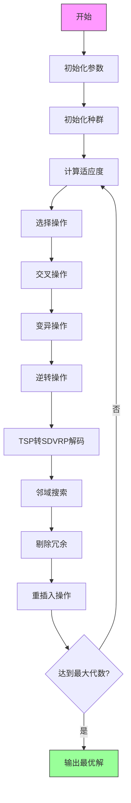

# GA_SDVRP - 需求可拆分车辆路径问题遗传算法求解器

## 问题描述

需求可拆分车辆路径问题（Split Delivery Vehicle Routing Problem, SDVRP）是经典车辆路径问题（VRP）的一个重要变种。在传统VRP中，每个客户点的需求必须由一个车辆一次性满足，而在SDVRP中，允许将单个客户的需求拆分成多个部分，由不同的车辆分别配送。

### 数学模型

#### 符号定义
- **集合**
  - $V = \{0, 1, 2, ..., n\}$：所有节点集合，其中0表示配送中心，$C = \{1, 2, ..., n\}$表示客户点集合
  - $K$：车辆集合

- **参数**
  - $d_i$：客户点$i$的需求量
  - $Q$：车辆的最大载重容量
  - $c_{ij}$：从节点$i$到节点$j$的运输成本（通常为距离）
  - $L$：车辆的最大行驶里程

- **决策变量**
  - $x_{ijk} \in \{0,1\}$：二进制变量，若车辆$k$从节点$i$直接前往节点$j$，则为1，否则为0
  - $y_{ik} \geq 0$：车辆$k$在客户点$i$的配送量

#### 目标函数
最小化总运输成本：
$$\min \sum_{k \in K} \sum_{i \in V} \sum_{j \in V} c_{ij} x_{ijk}$$

#### 约束条件
1. **需求满足约束**：每个客户点的需求必须被完全满足
   $$\sum_{k \in K} y_{ik} = d_i, \quad \forall i \in C$$

2. **车辆容量约束**：每辆车的总配送量不能超过其载重容量
   $$\sum_{i \in C} y_{ik} \leq Q, \quad \forall k \in K$$

3. **流量守恒约束**：确保每辆车从配送中心出发并最终返回配送中心
   $$\sum_{j \in V, j \neq i} x_{ijk} = \sum_{j \in V, j \neq i} x_{jik}, \quad \forall i \in V, \forall k \in K$$

4. **子环消除约束**：防止出现不包含配送中心的子环
   $$\sum_{i \in S} \sum_{j \in S, j \neq i} x_{ijk} \leq |S| - 1, \quad \forall S \subseteq C, \forall k \in K$$

5. **里程约束**：每辆车的总行驶距离不能超过最大里程限制
   $$\sum_{i \in V} \sum_{j \in V} c_{ij} x_{ijk} \leq L, \quad \forall k \in K$$

6. **配送量与路径关联约束**：只有在车辆访问客户点时才能进行配送
   $$y_{ik} \leq Q \cdot \sum_{j \in V} x_{jik}, \quad \forall i \in C, \forall k \in K$$

## 算法框架

### 遗传算法设计

#### 编码方案
采用基于TSP的编码方式：
- 使用包含所有客户点的排列作为染色体
- 通过特定解码算法将TSP路径转换为SDVRP解决方案
- 使用"1"作为分隔符表示车辆路径的结束和新路径的开始

#### 算法流程


#### 遗传算子
1. **选择算子**：基于适应度比例选择
2. **交叉算子**：部分匹配交叉（PMX）
3. **变异算子**：交换变异
4. **逆转算子**：2-opt局部优化

#### 适应度函数
$$fitness = \frac{1}{TotalCost + \alpha \cdot VehicleCost}$$
其中：
- $TotalCost$：所有车辆的总行驶距离
- $VehicleCost$：车辆使用成本（固定成本）
- $\alpha$：车辆成本权重系数

### 局部优化

#### 邻域搜索
- 2-opt交换
- 路径间客户点重定位
- 路径内客户点重排序

#### 冗余处理
- 自动识别并移除不必要的配送中心访问
- 优化路径结构，减少总成本

## 实验数据

### 测试算例
使用Solomon标准测试算例集，包含三种类型：

| 类型 | 特征描述 | 文件名 |
|------|----------|--------|
| C类 | 聚类分布客户点 | C101-C109 |
| R类 | 随机分布客户点 | R101-R112 |
| RC类 | 混合分布客户点 | RC101-RC108 |

### 数据格式
每个测试文件包含以下信息：
- 客户点编号
- X坐标、Y坐标（位置信息）
- 需求量
- 时间窗（起始时间、结束时间）
- 服务时间

### 参数设置
- **车辆参数**：
  - 载重容量：12-200单位
  - 最大行驶里程：90-600公里
  - 车辆固定成本：100-800

- **算法参数**：
  - 种群大小：20-80
  - 最大遗传代数：300-1000
  - 交叉概率：0.9
  - 变异概率：0.05-0.5
  - 代沟概率：0.9

### 运行示例
```matlab
% 基于Solomon算例运行
instance = importdata('./instance/R/R101.txt');
CustomerNum = 50;
[City, Demand, Distance] = sdvrp_instance(instance, CustomerNum);

% 运行遗传算法
Main.m
```

### 结果输出
算法输出包含：
1. 最优路径方案
2. 每辆车的具体配送路线
3. 总运输成本
4. 使用的车辆数量
5. 算法运行时间
6. 收敛曲线图
7. 路径可视化图

## 文件结构

```
GA_SDVRP/
├── Main.m                    # 主程序入口
├── GA_SDVRP.m               # 遗传算法主框架
├── Fitness.m                # 适应度计算
├── InitPop.m                # 种群初始化
├── Select.m                 # 选择算子
├── Crossover.m              # 交叉算子
├── Mutate.m                 # 变异算子
├── Reverse.m                # 逆转算子
├── Reins.m                  # 重插入操作
├── TSPtoChrom.m             # TSP到SDVRP转换
├── localsearch.m            # 邻域搜索
├── TextOutput.m             # 结果输出
├── DrawPath.m               # 路径可视化
├── sdvrp_instance.m         # 算例生成
├── instance/                # 测试算例目录
│   ├── C/                   # 聚类分布算例
│   ├── R/                   # 随机分布算例
│   └── RC/                  # 混合分布算例
└── test_data/               # 内置测试数据
```

## 使用说明

### 环境要求
- MATLAB R2018b或更高版本
- 无需额外工具箱

### 运行步骤
1. 设置工作目录到GA_SDVRP文件夹
2. 修改Main.m中的参数设置
3. 运行Main.m开始优化

### 自定义算例
可以通过修改以下参数来自定义问题：
- 客户点数量和位置
- 需求量分布
- 车辆容量和里程限制
- 算法参数设置