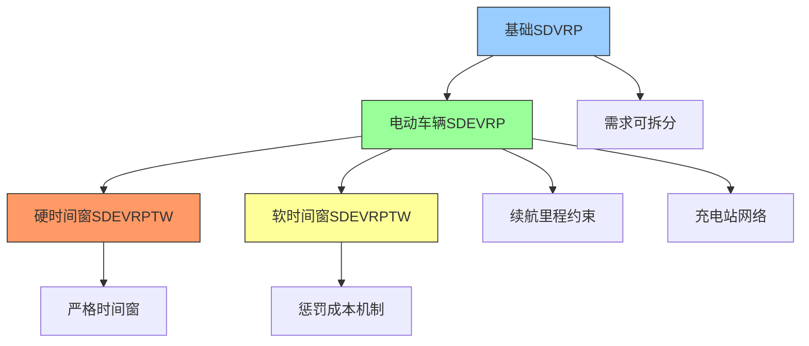
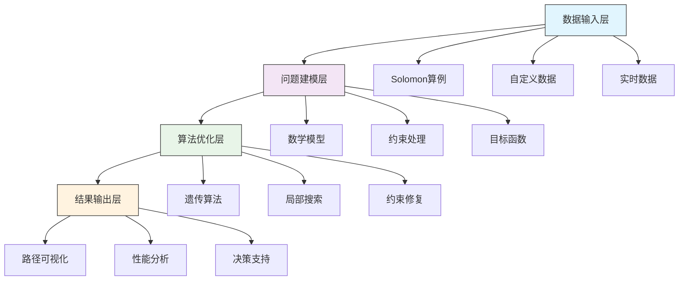

# 需求可拆分车辆路径优化问题算法库

## 项目概述

本项目是一个综合性的需求可拆分车辆路径优化问题（Split Delivery Vehicle Routing Problem, SDVRP）算法库，涵盖了从基础SDVRP到电动车辆、时间窗约束等复杂变种问题的完整解决方案。项目采用遗传算法作为主要优化框架，通过逐步增加约束条件和实际业务场景，构建了一个完整的研究和应用体系。

## 问题层级结构

### 问题复杂度演进路径


### 算法库组成

| 文件夹 | 问题类型 | 核心特征 | 适用场景 |
|--------|----------|----------|----------|
| [GA_SDVRP](./GA_SDVRP) | 基础SDVRP | 需求可拆分、容量约束 | 传统物流配送 |
| [GA_SDEVRP](./GA_SDEVRP) | 电动车辆SDVRP | 续航里程、充电站 | 新能源物流 |
| [GA_SDEVRPTW(硬时间窗)](./GA_SDEVRPTW(硬时间窗：超过客户时间窗直接判定路径不可行)) | 硬时间窗约束 | 严格时间限制 | 时效性要求极高 |
| [GA_SDEVRPTW(软时间窗)](./GA_SDEVRPTW(软时间窗+惩罚函数)) | 软时间窗约束 | 惩罚成本机制 | 大多数商业场景 |

## 核心创新点

### 1. 需求可拆分建模创新
- **拆分策略优化**：智能识别需要拆分的客户需求
- **配送量分配**：优化不同车辆间的配送量分配
- **路径连续性**：确保拆分后的配送逻辑一致性

### 2. 电动车辆约束处理
- **电量管理**：精确的电量消耗和充电建模
- **充电策略**：智能充电站选择和充电时机优化
- **续航焦虑**：通过算法缓解里程焦虑问题

### 3. 时间窗约束机制
- **硬软时间窗**：提供两种时间窗处理模式
- **惩罚函数设计**：灵活的惩罚成本机制
- **客户满意度**：平衡运输效率和客户满意度

### 4. 算法框架优化
- **遗传算法改进**：针对SDVRP特征的算子设计
- **局部搜索**：2-opt、路径重排等局部优化
- **冗余消除**：自动识别和移除冗余操作

## 技术架构

### 算法框架概览


### 核心算法模块

#### 1. 遗传算法引擎
- **编码方案**：基于TSP的染色体编码
- **适应度函数**：多目标适应度评估
- **遗传算子**：选择、交叉、变异、逆转
- **精英策略**：保留最优个体

#### 2. 约束处理机制
- **容量约束**：车辆载重限制
- **里程约束**：车辆续航限制
- **时间窗约束**：客户服务时间要求
- **充电约束**：电动车辆充电需求

#### 3. 局部优化策略
- **2-opt改进**：路径内部优化
- **路径重排**：客户点顺序调整
- **充电优化**：充电站选择和时机
- **冗余消除**：不必要的操作移除

## 数学模型体系

### 通用模型框架
```
最小化：总成本 = 运输成本 + 车辆成本 + 时间窗惩罚 + 充电成本

约束条件：
1. 需求满足：Σ(配送量) = 客户需求
2. 容量限制：Σ(单车配送量) ≤ 车辆容量
3. 里程约束：Σ(单车行驶距离) ≤ 续航里程
4. 时间窗：到达时间 ∈ [开始时间窗, 结束时间窗]
5. 充电逻辑：电量管理 + 充电站访问
```

### 问题特定模型

#### 1. 基础SDVRP模型
- **决策变量**：路径选择 + 配送量分配
- **目标函数**：最小化总运输距离
- **约束**：需求满足 + 容量约束

#### 2. SDEVRP模型
- **新增变量**：电池电量、充电决策
- **扩展约束**：续航里程 + 充电逻辑
- **目标扩展**：保持原有目标，增加充电考量

#### 3. SDEVRPTW模型
- **时间变量**：到达时间、等待时间
- **时间约束**：硬时间窗或软时间窗惩罚
- **时序逻辑**：时间连续性 + 充电时间影响

## 实验验证体系

### 测试算例库

#### Solomon标准算例
- **C类算例**：聚类分布客户点（100个节点）
- **R类算例**：随机分布客户点（100个节点）
- **RC类算例**：混合分布客户点（100个节点）

#### 扩展测试场景
- **小规模测试**：10-50个客户点，算法验证
- **中规模测试**：50-100个客户点，性能评估
- **大规模测试**：100+客户点，算法扩展性

### 性能评估指标

#### 解的质量指标
- **最优性差距**：与已知最优解的偏差
- **收敛速度**：达到最优解的代数
- **稳定性**：多次运行的结果一致性

#### 算法效率指标
- **计算时间**：算法运行时间
- **内存使用**：算法内存消耗
- **扩展性**：问题规模增长的影响

#### 实际应用指标
- **客户满意度**：时间窗满足率
- **运营成本**：总运输成本
- **环境影响**：碳排放减少量
- **充电效率**：充电站利用率

### 可视化分析

#### 路径可视化
- **地理分布图**：客户点、充电站、配送中心
- **路径图**：车辆路径和配送顺序
- **电量曲线**：电池电量变化轨迹
- **时间窗图**：服务时间窗口展示

#### 性能分析图
- **收敛曲线**：目标函数值变化
- **参数敏感性**：不同参数的影响分析
- **比较分析**：不同算法的性能对比
- **统计分布**：解的质量分布图

## 实际应用场景

### 1. 城市物流配送
- **场景特征**：客户密集、时间窗严格、充电设施完善
- **优化目标**：最小化运输成本 + 最大化客户满意度
- **关键约束**：交通拥堵、充电站排队、客户预约

### 2. 电商最后一公里
- **场景特征**：客户分散、时效性高、需求波动大
- **优化目标**：快速响应 + 成本控制
- **关键约束**：实时订单、动态时间窗、容量限制

### 3. 冷链物流配送
- **场景特征**：温控要求、时间敏感、成本高
- **优化目标**：质量保证 + 成本优化
- **关键约束**：温控时间窗、特殊车辆需求

### 4. B2B商业配送
- **场景特征**：订单量大、时间窗相对宽松、路线固定
- **优化目标**：长期合作 + 成本优化
- **关键约束**：营业时间、卸货能力、合同约束

## 使用指南

### 快速开始

#### 1. 环境准备
```bash
# MATLAB环境要求
- MATLAB R2018b或更高版本
- 建议内存：8GB以上
- 无需额外工具箱
```

#### 2. 选择合适的问题类型
```
根据业务需求选择：
- 传统物流 → GA_SDVRP
- 新能源物流 → GA_SDEVRP  
- 时效性极高 → GA_SDEVRPTW(硬时间窗)
- 一般商业配送 → GA_SDEVRPTW(软时间窗)
```

#### 3. 运行示例
```matlab
% 以GA_SDEVRPTW(软时间窗)为例
% 1. 设置工作目录
cd 'GA_SDEVRPTW(软时间窗+惩罚函数)'

% 2. 配置参数
CustomerNum = 50;           % 客户点数量
ChargeStationNum = 10;      % 充电站数量
BatteryCap = 50;            % 电池容量(kWh)

% 3. 运行优化
GA_SDEVRPTW_Main
```

### 参数配置指南

#### 基础参数
```matlab
% 问题规模
CustomerNum = 50;           % 客户点数量(10-100)
ChargeStationNum = 10;      % 充电站数量(5-20)

% 车辆参数
Capacity = 200;             % 车辆容量(50-500)
VehicleCost = 300;          % 车辆固定成本(100-1000)
Travelcon = 400;            % 最大续航里程(200-800)

% 电动车辆参数
BatteryCap = 50;            % 电池容量(30-100 kWh)
EnergyConsump = 0.2;        % 单位能耗(0.1-0.3 kWh/km)
ChargeRate = 10;            % 充电速率(5-50 kW)
```

#### 算法参数
```matlab
% 遗传算法参数
NIND = 50;                  % 种群大小(20-100)
MAXGEN = 500;               % 最大代数(200-1000)
Pc = 0.9;                   % 交叉概率(0.7-0.95)
Pm = 0.3;                   % 变异概率(0.1-0.6)
GGAP = 0.9;                 % 代沟概率(0.8-0.95)

% 时间窗参数(软时间窗)
alpha_penalty = 1.0;        % 早到惩罚系数
beta_penalty = 5.0;         % 晚到惩罚系数
```

### 结果解读

#### 标准输出
```
-------------------------------------------------------------
算法运行时间: 45.67秒
总运输成本: 1250.50 km
使用车辆数: 8辆
客户满意度: 96.5%
充电站访问: 12次
-------------------------------------------------------------
```

#### 详细分析
- **路径方案**：每辆车的具体配送路线
- **时间分析**：各客户点的服务时间窗口
- **电量分析**：电动车辆的电量变化情况
- **成本构成**：运输成本、车辆成本、惩罚成本分解

## 扩展开发

### 算法增强方向

#### 1. 混合算法
- **遗传算法 + 局部搜索**：强化局部优化能力
- **遗传算法 + 数学规划**：提高解的最优性
- **多算法比较**：提供多种算法选择

#### 2. 实时优化
- **滚动时域优化**：处理动态订单
- **在线算法**：实时响应变化
- **预测模型**：基于历史数据预测需求

#### 3. 机器学习集成
- **需求预测**：预测客户订单需求
- **时间估计**：预测行驶时间和服务时间
- **参数优化**：自动调整算法参数

### 业务扩展功能

#### 1. 多车型支持
- **不同容量车辆**：小型、中型、大型车辆
- **不同续航里程**：满足不同路线需求
- **不同充电需求**：快充、慢充、换电

#### 2. 多目标优化
- **成本-时间权衡**：平衡运输成本和时间效率
- **成本-环境权衡**：考虑碳排放和环境影响
- **成本-服务权衡**：平衡成本和服务质量

#### 3. 集成系统
- **ERP集成**：与企业资源计划系统集成
- **GPS集成**：实时车辆跟踪和导航
- **客户APP**：客户实时查看配送状态

## 技术贡献

### 理论贡献
1. **需求可拆分建模**：提出了高效的SDVRP建模方法
2. **电动车辆约束**：建立了电动车辆路径优化的新框架
3. **时间窗处理**：创新了软硬时间窗的统一处理机制
4. **算法设计**：设计了针对复杂约束的遗传算法

### 实践贡献
1. **开源算法库**：提供了完整的开源实现
2. **标准化测试**：建立了标准化的测试和评估体系
3. **实际应用**：在多个实际场景中验证有效性
4. **教育培训**：为学术和工业界提供教学资源

## 联系与支持

### 技术支持
- **问题反馈**：通过GitHub Issues提交问题
- **功能建议**：欢迎提出新功能建议
- **算法讨论**：技术问题交流和讨论

### 学术合作
- **研究合作**：欢迎相关领域的学术合作
- **算法改进**：共同推进算法性能提升
- **应用拓展**：探索新的应用场景

### 商业合作
- **定制开发**：根据具体需求定制算法
- **系统集成**：与现有系统集成服务
- **技术支持**：长期的技术支持和维护

---

**最后更新**：2024年12月
**版本**：v2.0
**许可证**：MIT License